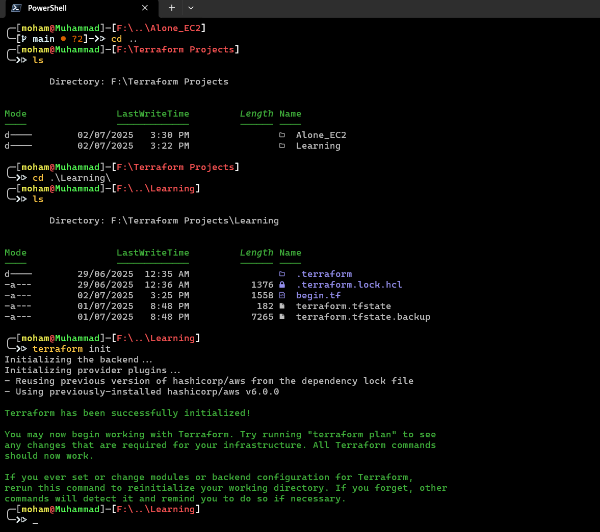
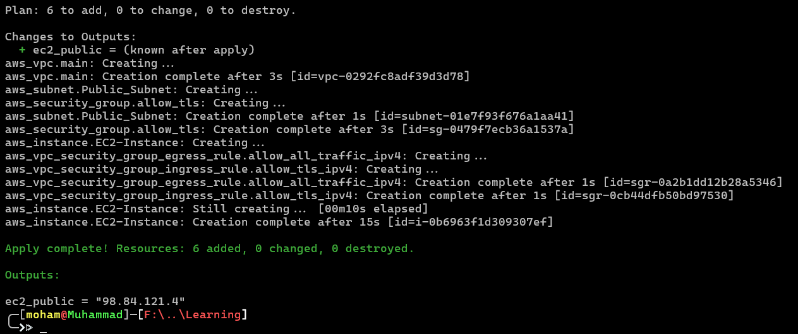
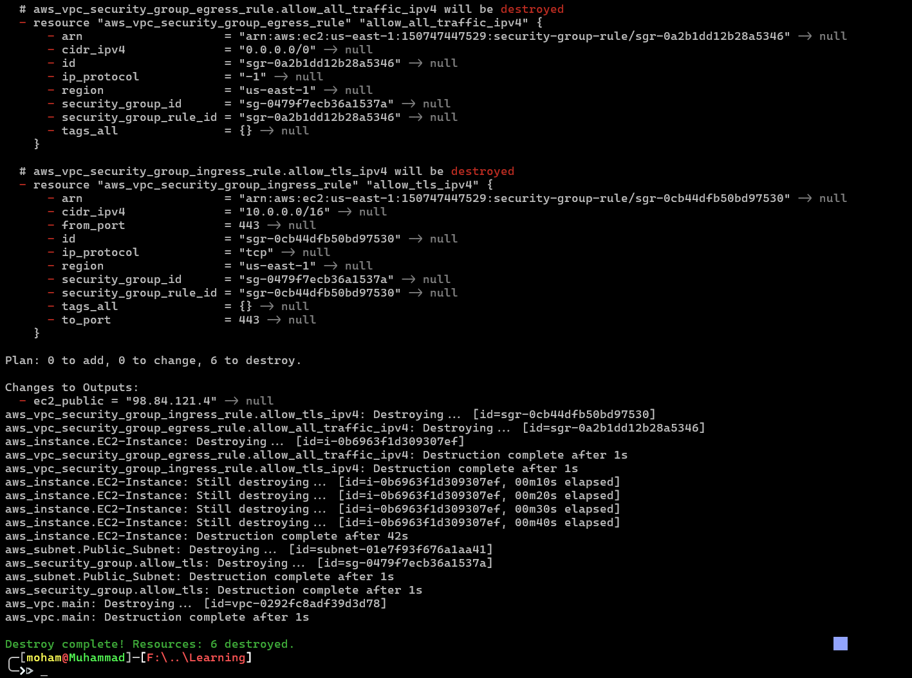

# Alone_EC2
My First Terraform Project, covering the some core concepts and services in AWS (VPC, EC2, Subnets, Security groups) + output block

All the requirments and the writen solution in requirments.txt file

this project is the the first Actual project in a Terraform course i study with

Here is the diagram of the solution

Note: you will find in the Assest directory 2 Photos of the diagram one is a screenshot for show only
      the other one is .drawio.png, this one is editable if you want to customize the diagram

1- initiation process

2- Validation and plan commands run

3- Apply the Infrustructure on AWS

4- Terraform destory command

